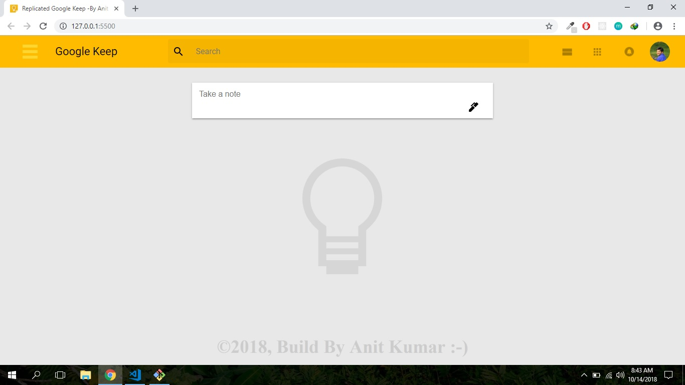
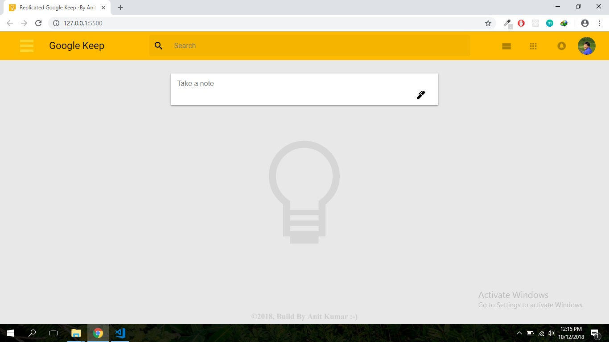
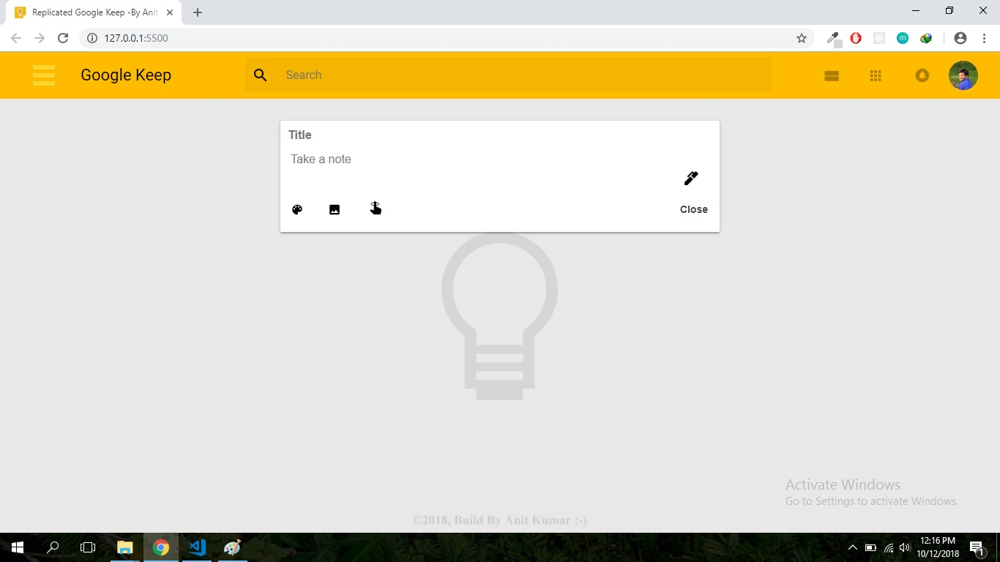
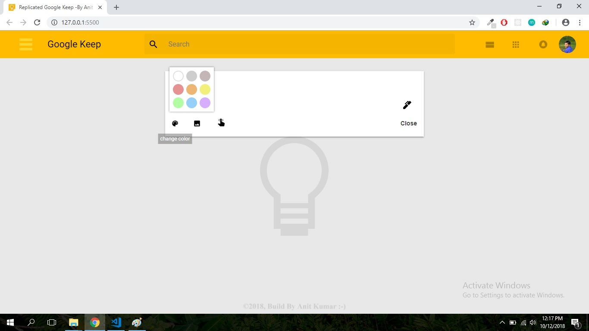
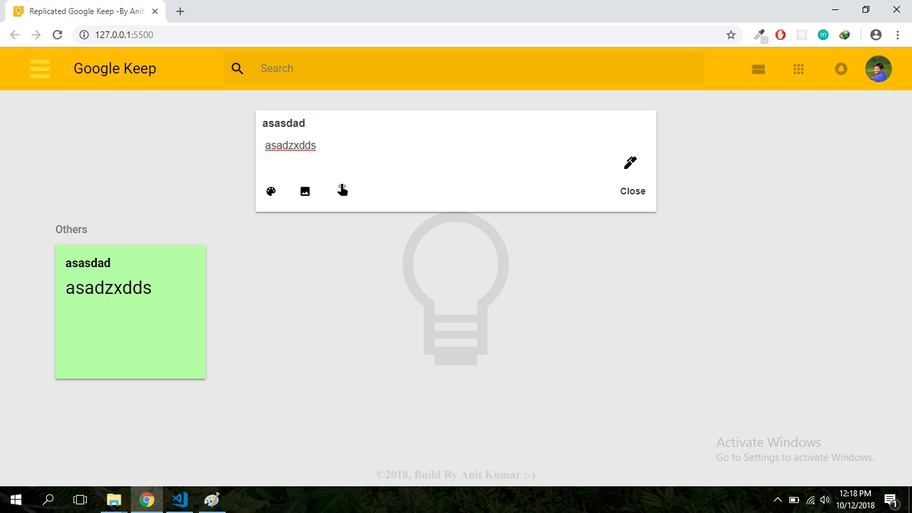

# Replicated Google Keep
**Version 1.0.0**
## What is this ?
A replicated Google Keep build using pure html,css and javascript,used to keep important notes at one place.
### [Live Demo](https://anitkumarsingh.github.io/Note-Keeper/)

###### Screenshots

--
## Install
There is no special setup required for this project to run.Just need browser and you are ready to rock!!
Open index.html in any modern browser like chrome, firefox etc.

---
#### @ Anit Kumar, 2018  :blush:
